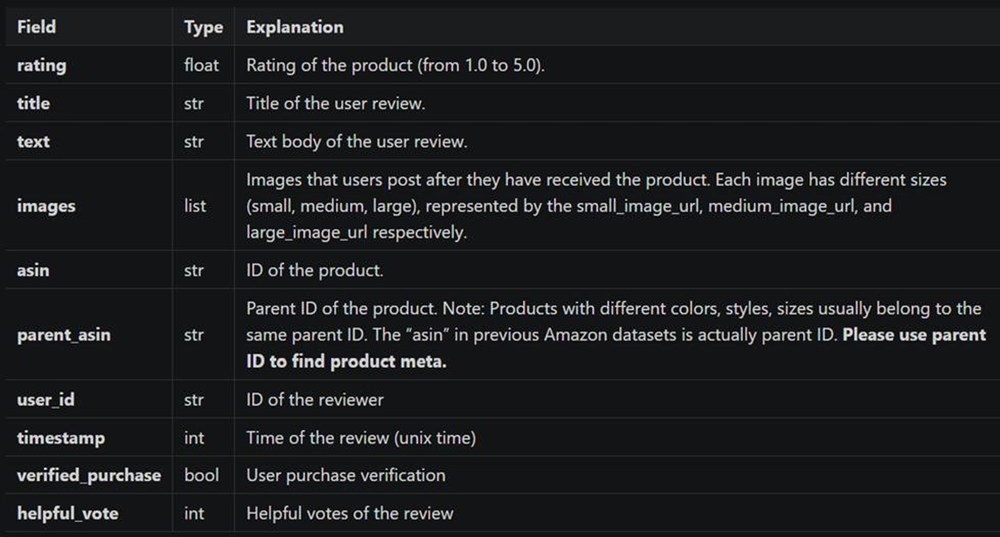
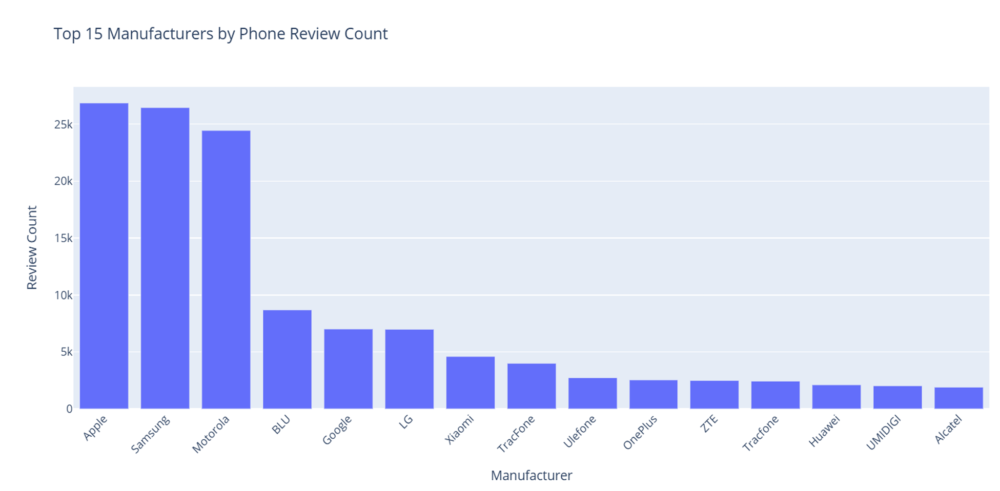
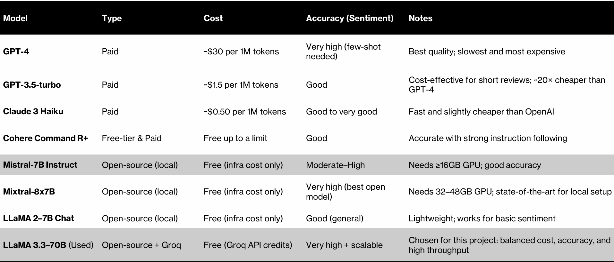
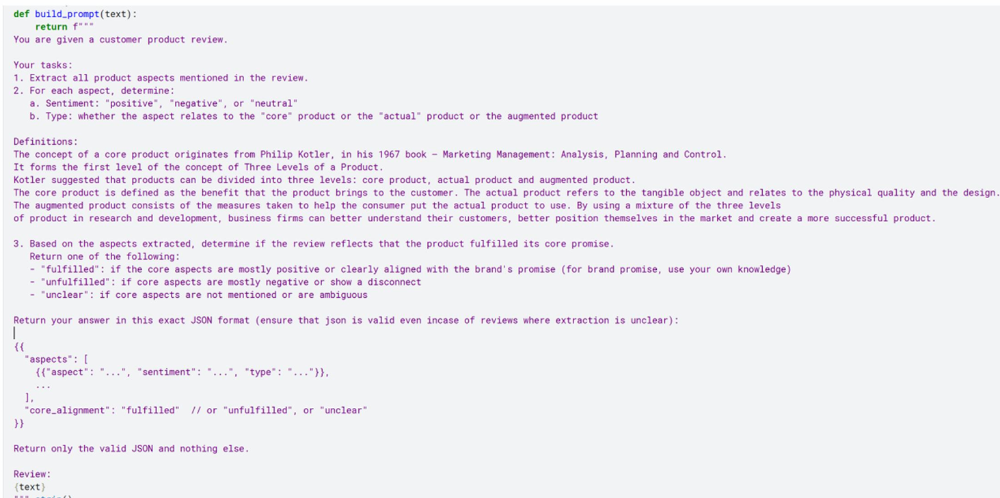
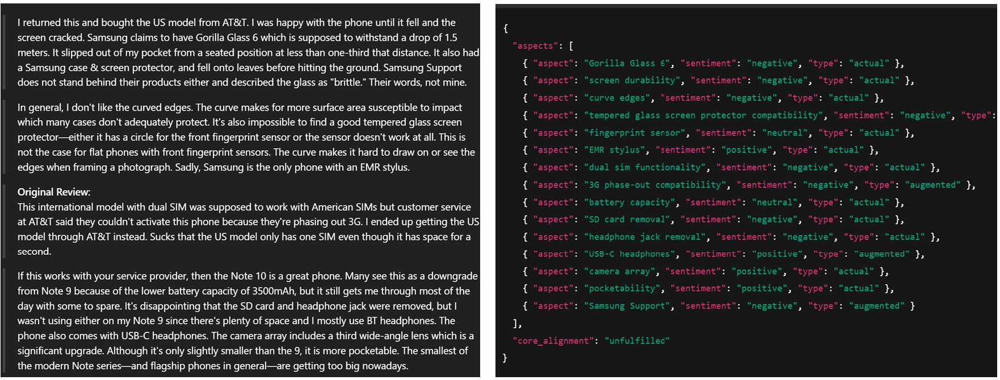
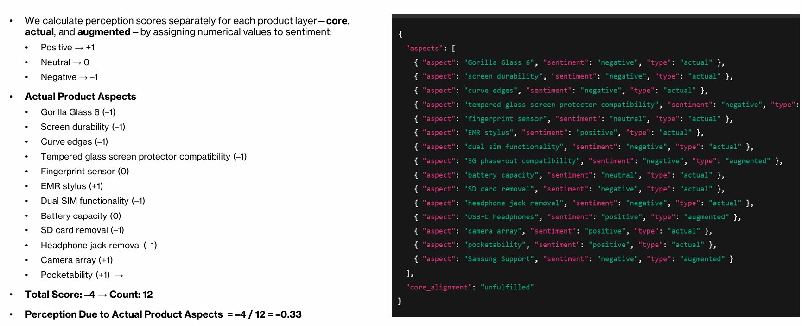
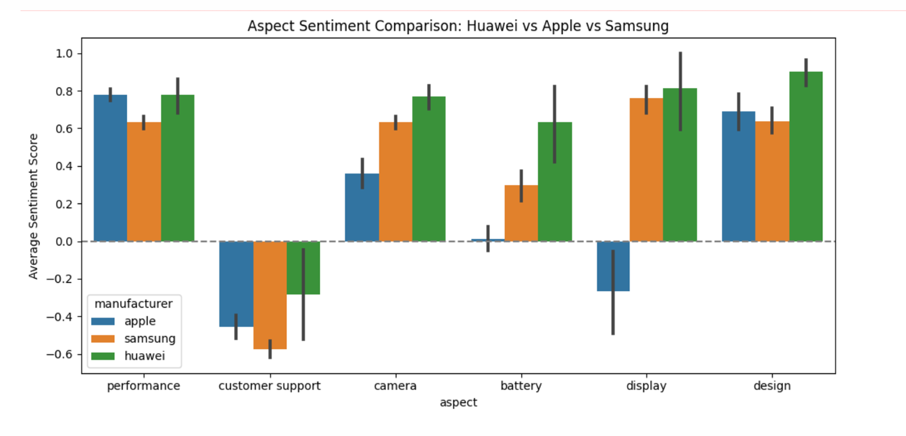
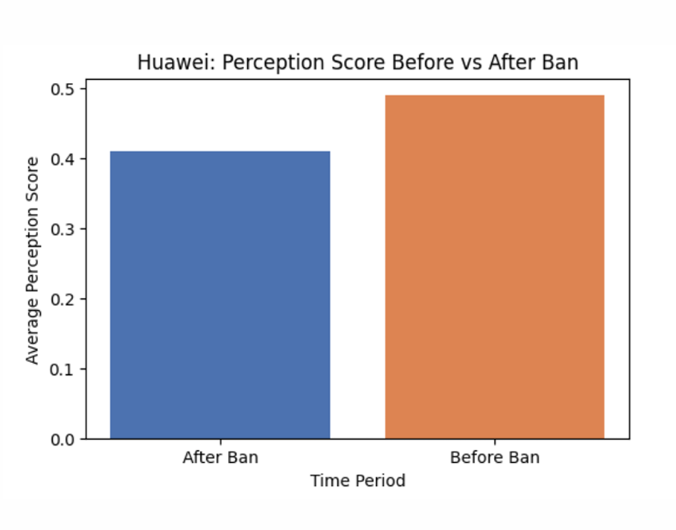

# Quantifying Brand Perception from Customer Reviews using Generative AI

Author: Rituraj Banerjee  
---

# The Problem: Measuring Brand Perception at Scale

Brand perception is one of the most valuable intangible assets a company has.

It influences:

- purchase decisions
- brand loyalty
- pricing power
- long term brand equity

However measuring brand perception is extremely difficult.

Most companies rely on methods such as:

• customer surveys  
• Net Promoter Score  
• brand studies  

These approaches have major limitations.

According to industry studies:

- typical survey response rates are **around 33 percent**
- NPS surveys often receive **less than 20 percent response rates**

This means brand decisions are often based on **a very small portion of customers**.

There are also several sources of bias:

• social desirability bias  
• recall bias  
• sample selection bias  

These issues make traditional brand perception measurement **slow, expensive, and often inaccurate**.

Yet consumers continuously express their opinions about brands in a much richer format.

They write product reviews.

They share complaints.

They post experiences.

Every one of these interactions contains **valuable signals about brand perception**.

The challenge is that these signals are **unstructured text data**.

Traditional analytics tools cannot process millions of reviews efficiently.

This creates an opportunity for Generative AI.

---

# The Core Idea

Instead of asking customers how they feel about a brand, we can **observe what they say naturally**.

Customer reviews contain detailed feedback about product attributes such as:

- battery life
- camera quality
- durability
- customer service
- price perception

Large Language Models can extract these signals automatically.

The approach used in this project:

1. Extract product aspects from reviews
2. Identify sentiment for each aspect
3. Map each aspect to a marketing framework
4. Convert sentiments into quantitative perception scores

This converts raw review text into **structured brand intelligence**.

---

# Marketing Framework Used

The extracted aspects are mapped to **Philip Kotler’s Three Levels of Product**.

### Core Product

The fundamental value delivered by the product.

Examples:

- performance
- reliability
- usability

### Actual Product

The physical and tangible features of the product.

Examples:

- design
- hardware quality
- screen
- camera

### Augmented Product

Additional services or benefits around the product.

Examples:

- customer support
- accessories
- warranty
- ecosystem integration

This layered structure allows us to understand **why customers perceive brands differently**.

---

# Example Review Processing

Example review:

> "The design feels cheap."

LLM extraction produces structured output:

| Aspect | Sentiment | Product Layer |
|------|------|------|
Design | Negative | Actual Product |

Sentiment values are then converted into numbers:

Positive = +1  
Neutral = 0  
Negative = -1

These values are aggregated to compute brand perception scores.

---

# Dataset

The dataset used for the project is the Amazon Reviews 2023 dataset.

Dataset characteristics:

Source: Amazon Reviews 2023 dataset  
Category: Mobile Phones and Accessories  

Dataset scale:

- ~9.34 GB review text
- ~4.02 GB product metadata
- ~11.6 million reviews

For this project the dataset was filtered to focus on **mobile phones only**.

Final dataset used:

- **187,261 mobile phone reviews**
- Time period: **2018 to 2023**
- Geography: **United States**

The review schema used in the dataset is shown below.

*(Schema from dataset documentation and presentation)* :contentReference[oaicite:0]{index=0}

---

# Data Preprocessing

The dataset required significant filtering and cleaning.

Steps included:

### Filtering Relevant Products

The original dataset contained accessories and unrelated products.

Filtering involved:

- category hierarchy filtering
- zero shot classification using BART

Only reviews identified as **mobile phones** were retained.

### Metadata Enrichment

Brand names were standardized.

More than **2200 manufacturers** were present in the dataset.

The analysis focused on the **top 15 brands by review volume**.

Example distribution:

*(Bar chart shown in the presentation)* :contentReference[oaicite:1]{index=1}

---

# Model Selection

Multiple LLM models were evaluated. Model comparison is shown below.

 :contentReference[oaicite:2]{index=2}

The final model selected:

**LLaMA 3.3-70B**

Reasons:

- strong reasoning ability
- good sentiment accuracy
- high throughput
- cost effective when deployed via Groq

---

# Prompt Engineering

A structured prompt was designed to extract:

- product aspects
- sentiment polarity
- product layer classification

Example prompt structure:

1 Identify aspects mentioned in review  
2 Classify sentiment  
3 Map to product layer  
4 Return structured JSON output  

Example output format:
{
"aspect": "battery",
"sentiment": "positive",
"type": "core"
}

Prompt is shown below.

 :contentReference[oaicite:3]{index=3}

---

# Perception Score Calculation

Each aspect sentiment is converted into a numeric value.

Positive = +1  
Neutral = 0  
Negative = -1

Scores are averaged by product layer.

Actual product aspects extracted from one review:

Example from the presentation:

 :contentReference[oaicite:4]{index=4}
---

# Results

The model generated perception scores for each brand.

Scores were computed across three layers:

- core product
- actual product
- augmented product

Example visualization:

 :contentReference[oaicite:5]{index=5}

---

# Brand Comparison

The project compared perception across major smartphone brands.

Key brands analyzed:

- Apple
- Samsung
- Huawei

Example comparison chart:

 :contentReference[oaicite:6]{index=6}

---

# Case Study: Huawei and the U.S. Ban

Huawei faced major regulatory restrictions in the United States.

Key events:

2018  
National Defense Authorization Act banned federal use of Huawei hardware.

2019  
Huawei added to the U.S. Entity List.

This prevented collaboration with companies such as:

- Google
- Intel
- Qualcomm

This created an interesting research question.

Did brand perception change after the ban?

Visualization from the presentation:

 :contentReference[oaicite:7]{index=7}

---

# Hypothesis Testing

### Test 1

Did Huawei perception change after the ban?

Method:

Independent two sample t test.

Results:

t statistic = 2.57  
p value = 0.0101  

Conclusion:

Huawei perception **declined significantly after the ban**.

---

### Test 2

Do different brands have different perception scores?

Method:

One way ANOVA.

Results:

F statistic = 71.68  
p value = 1.98e-204  

Conclusion:

Brand perception varies significantly across brands.

Post hoc analysis shows:

Samsung > Apple > Huawei

---

# Key Product Insights

This project reveals several important insights.

1. Hardware performance drives perception strongly.

Battery life, camera quality, and display are major drivers of positive sentiment.

2. Brand perception is multi dimensional.

A brand may perform well in product features but poorly in services.

3. External events affect perception.

Regulatory actions such as the Huawei ban influence consumer sentiment.

4. Generative AI can transform unstructured feedback into structured marketing intelligence.

---

# Business Applications

This framework can be used for:

Product management  
Brand monitoring  
Competitive intelligence  
Customer experience analytics  
Market research  

Companies can monitor **brand perception continuously instead of relying on surveys**.

---

# Limitations

The study has several limitations.

Geographic scope is limited to the United States.

Online reviews often represent extreme opinions.

Results depend on model performance and prompt design.

---

# Future Work

Potential extensions include:

Linking perception scores with product sales.

Monitoring perception trends over time.

Incorporating additional feedback sources such as images and ratings.

Applying the framework across multiple product categories.

---

# Project Files

Project Report  
brand-perception-report.pdf

Presentation  
brand-perception-presentation.pdf

---

# Project Takeaway

This project demonstrates how Generative AI can convert millions of unstructured reviews into actionable brand insights.

It bridges marketing theory with modern AI techniques to create a scalable method for measuring brand perception.

## References

Hou, Y., Li, J., He, Z., Yan, A., Chen, X., & McAuley, J. (2024).  
Bridging Language and Items for Retrieval and Recommendation.  
arXiv:2403.03952.

Amazon Reviews 2023 Dataset  
https://amazon-reviews-2023.github.io/
